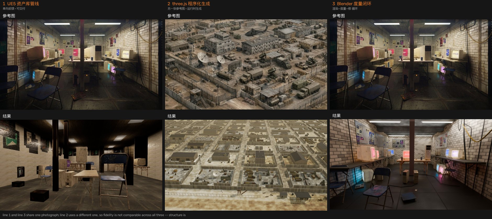
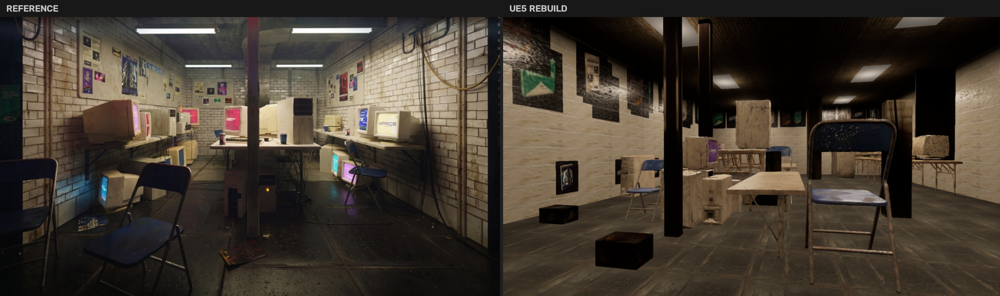
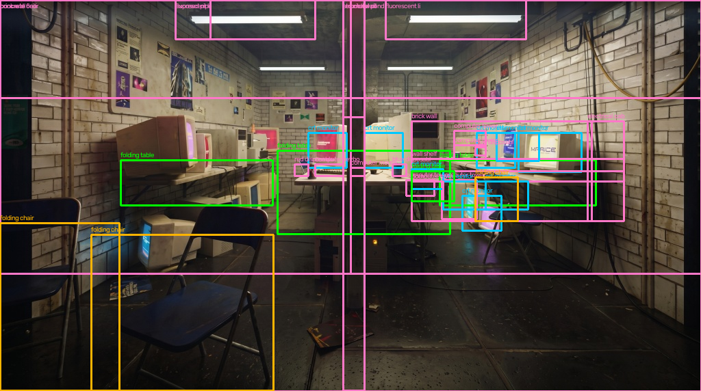
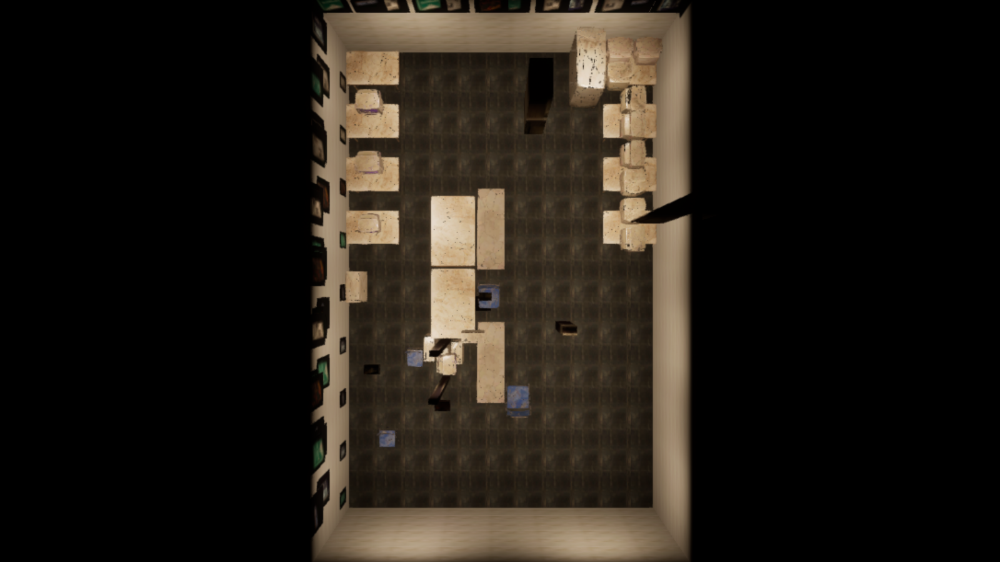
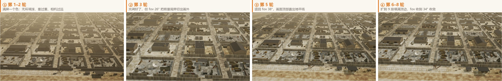
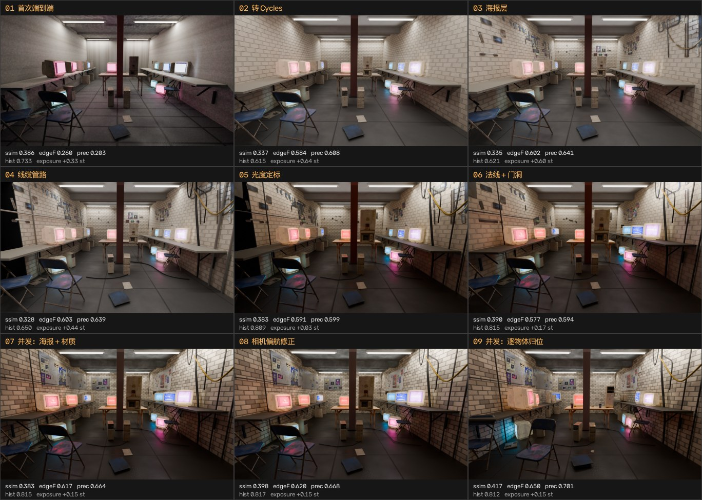

# AI Scene Builder — 一张参考图 → 三维场景的三条路

> ### 📖 在线阅读（推荐）
> **[https://seanwilliam2077.github.io/AI-PCG-Scene/](https://seanwilliam2077.github.io/AI-PCG-Scene/)**
>
> **四份主文档都是可动手的交互页**（拖动对比、逐步播放、图上探针、可筛选表格、参数滑块）。
> GitHub 的文件视图对 `.html` 一律显示**源码**，点开看到的是代码不是网页 —— 这是它的安全设计，
> public / private 都一样。要动手请走上面的站点，或直接点下面的链接：
>
> | | 在线网页（可动手） | 仓库源码 |
> |---|---|---|
> | 线 1 · UE5 资产库管线 | **[打开](https://seanwilliam2077.github.io/AI-PCG-Scene/docs/%E6%8A%80%E6%9C%AF%E6%96%B9%E6%A1%88%E6%8A%A5%E5%91%8A.html)** | [源码](docs/技术方案报告.html) |
> | 线 2 · three.js 程序化生成 | **[打开](https://seanwilliam2077.github.io/AI-PCG-Scene/docs/%E5%AF%B9%E7%85%A7%E5%AE%9E%E9%AA%8C-%E7%A8%8B%E5%BA%8F%E5%8C%96%E5%9C%BA%E6%99%AF%E9%87%8D%E5%BB%BA.html)** | [源码](docs/对照实验-程序化场景重建.html) |
> | 线 3 · Blender 度量闭环 | **[打开](https://seanwilliam2077.github.io/AI-PCG-Scene/docs/%E8%BF%98%E5%8E%9F%E5%BA%A6%E9%97%AD%E7%8E%AF%E8%BF%AD%E4%BB%A3.html)** | [源码](docs/还原度闭环迭代.html) |
> | 三线对照 | **[打开](https://seanwilliam2077.github.io/AI-PCG-Scene/docs/%E4%B8%89%E7%BA%BF%E5%AF%B9%E7%85%A7-%E5%8D%95%E5%9B%BE%E5%88%B0%E4%B8%89%E7%BB%B4%E5%9C%BA%E6%99%AF.html)** | [源码](docs/三线对照-单图到三维场景.html) |
> | 白盒 Live · 传一张图当场出白盒 | **[打开](https://seanwilliam2077.github.io/AI-PCG-Scene/whitebox/)** | [源码](tools/whitebox-web/) |

同一个命题：**给一张参考图，能不能自动生成一个三维场景。**
这个仓库里有三条互相独立的实现，各自回答这个命题的不同侧面，
并附一份把三条放在一起走查的对照文档。

四份文档不是排版稿，是可动手的网页：每一份都以「参考图 vs 结果」的拖动对比开场，
往下有逐步播放的迭代器、图上探针、可筛选的数据表、以及能当场重算的参数滑块。
**页面里的每个读数都取自仓库内的机器留痕**（`run_summary.json` / `api_calls.jsonl` /
`match_report.json` / `scene_manifest.json`、归档源码的实跑回读等），没有一处是事后补写的；
数据不支持的图表就没有画，各页都写明了哪些想做而做不到、为什么。

<p align="center">
  
  <br><em>三条线各自的参考图（上）与结果（下）</em>
</p>

## 三条方案

| | 线 1 · UE5 资产库管线 | 线 2 · three.js 程序化生成 | 线 3 · Blender 度量闭环 |
|---|---|---|---|
| **回答的问题** | AI 能不能替人搭一个**可交付**的关卡 | 一张图能不能变成一类场景的**生成器** | 允许无限循环，还原度的**上限**在哪 |
| **驱动方式** | 单向前馈：AI 出提案，规则做裁决 | 目视驱动：每轮并排看，挑最刺眼的改 | 度量驱动：先把「像不像」变成可测量的量 |
| **资产来源** | 39 模块资产库，四级瀑布匹配 | 全部由代码运行时生成，零外部文件 | 39 模块资产库 + 参考图自身矫正回贴 |
| **参考图** | 室内机房 | 沙漠前进作战基地（**另一张**） | 室内机房（与线 1 同一张） |
| **运行环境** | UE 5.5 编辑器内嵌 Python | 浏览器 WebGL2 实时 | Blender 4.2 / Cycles 离线 |
| **文档** | **[技术方案报告](https://seanwilliam2077.github.io/AI-PCG-Scene/docs/%E6%8A%80%E6%9C%AF%E6%96%B9%E6%A1%88%E6%8A%A5%E5%91%8A.html)** | **[对照实验-程序化场景重建](https://seanwilliam2077.github.io/AI-PCG-Scene/docs/%E5%AF%B9%E7%85%A7%E5%AE%9E%E9%AA%8C-%E7%A8%8B%E5%BA%8F%E5%8C%96%E5%9C%BA%E6%99%AF%E9%87%8D%E5%BB%BA.html)** | **[还原度闭环迭代](https://seanwilliam2077.github.io/AI-PCG-Scene/docs/%E8%BF%98%E5%8E%9F%E5%BA%A6%E9%97%AD%E7%8E%AF%E8%BF%AD%E4%BB%A3.html)** |

**最后一份文档把三条放在一起比：
[三线对照 — 同一个模型，三种软件环境](https://seanwilliam2077.github.io/AI-PCG-Scene/docs/%E4%B8%89%E7%BA%BF%E5%AF%B9%E7%85%A7-%E5%8D%95%E5%9B%BE%E5%88%B0%E4%B8%89%E7%BB%B4%E5%9C%BA%E6%99%AF.html)**。

> **先说清楚可比性的边界。** 线 1 与线 3 用的是同一张室内参考图，线 2 用的是另一张。
> 所以三条线之间**不能直接比还原度**，能比的是方法结构；一切定量对照都限制在线 1 与线 3 之间。

---

## 线 1 · UE5 资产库管线（主线，可交付）

> 在线阅读：**[打开网页](https://seanwilliam2077.github.io/AI-PCG-Scene/docs/%E6%8A%80%E6%9C%AF%E6%96%B9%E6%A1%88%E6%8A%A5%E5%91%8A.html)**　·　源码：[docs/技术方案报告.html](docs/技术方案报告.html) ·
> 差距分析：[docs/补充说明-复现差距分析.html](docs/补充说明-复现差距分析.html)

本管线的完整实现与过程留档。核心命题是「AI 能不能替人搭场景」，
而这份实现给出的答案是一句设计主线：

> **AI 出提案，规则做裁决。**

所有 AI 输出（检测框、三维盒、尺寸、氛围参数）都不直接进场景——一律先过确定性的
校验、钳制、推导，再由规则链决定最终摆放。这让管线在模型发挥不稳定时依然产出
一个"不出怪物"的场景。

<p align="center">
  
  <br><em>左：输入参考图　|　右：管线自动搭建的 UE5 场景（同一机位）</em>
</p>

| 指标 | 数值 |
|---|---|
| 端到端耗时 | **146.7 s**（五阶段各自最近一次实测之和，温缓存） |
| 装配结果 | **127 actors / 0 errors** |
| 穿模 / 悬空 | **0 / 0**（独立会话加载存盘关卡复测，非装配会话自报） |
| 资产匹配 | 36 求解对象 → 30 进匹配 → 21 库命中 + 9 代理盒 |
| 交付工程包 | 381 MB（限 500 MB） |
| AI 调用留痕 | 231 次，168 次命中缓存（72.7%），1706.1 s 全部落在 63 次未命中上 |
| 可复现性 | 离线回放，评审机零外网、零 API Key |

文档里可以动手的部分：五阶段 stepper（每步一张自有配图 + 该阶段的实测秒数/计数/调用数）、
感知探针（36 个求解对象 ↔ 70 条原始检测框可切换，读出解算方法与 margin_px）、
「一像素的代价」滑块（`depth = h·fy/margin_px` 的真实误差传播，每个对象的 cm/px 灵敏度相差 93 倍）、
30 行 × 6 组筛选的资产匹配表、127 actor 的 SVG 俯视图（7 类图例可开关）、
以及 231 次 AI 调用的时间线与逐条可翻的表。

```
离线段（一次性）
  参考图 → 云端图像拆分 → 云端图生 3D（高模 + PBR）
         → 减面 / 贴图降档 / ORM 合并 → VLM 受控词表打标
         → 39 模块资产库（预导入 uasset）

运行段（每次跑图，全程在 UE 编辑器内）
  s01 感知   检测 / 分割 / 标定      四象限分块召回，JSON 本地校验 + 修复重试
  s02 布局   地面射线求解            纯 numpy，无 AI 参与
  s03 素材   无缝材质 / 海报 / 氛围   单点取样重铺，参数钳制
  s04 匹配   资产库四级瀑布匹配       畸形缩放保护
  s05 装配   布局规则链 + 回执        去穿插 → 重力吸附 → 微推挤 → 回执 → 存盘
```

<p align="center">
  
  
  <br><em>左：s01 感知逐件检出（70 检测）　|　右：装配后俯视布局</em>
</p>

---

## 线 2 · three.js 程序化生成（规则驱动）

> 在线阅读：**[打开网页](https://seanwilliam2077.github.io/AI-PCG-Scene/docs/%E5%AF%B9%E7%85%A7%E5%AE%9E%E9%AA%8C-%E7%A8%8B%E5%BA%8F%E5%8C%96%E5%9C%BA%E6%99%AF%E9%87%8D%E5%BB%BA.html)**　·　源码：[docs/对照实验-程序化场景重建.html](docs/对照实验-程序化场景重建.html)
> （另有 `.pdf`）· 完整可运行源码：`process/threejs_fob/`

换一张参考图（沙漠前进作战基地）、换 three.js 实时渲染，回答一个不同的问题：
**不匹配资产库、几何与贴图全部由代码生成，一张图能不能变成一类场景的生成器。**

<p align="center">
  
  <br><em>八轮迭代的四个里程碑，每格标注当时看到的问题与所做的修改</em>
</p>

| 指标 | 值 |
|---|---|
| 构件数 / 顶点数 | 44 897 / 1.70 M（归档源码实跑；当时出图版本记录 44 441，差 1%） |
| 合并后网格 | **14**（12 个材质桶 + 2 层地面）——声明了 13 个材质，`concreteDS` 实跑零调用点 |
| 每帧 draw call | 60（关掉 GTAO 降到 30），`renderer.info` 读回 |
| 院落 | **121**（11 列 × 11 排；旧文写的「11 列 × 9 排」是错的） |
| 外部模型与图片文件 | **0**（几何与贴图全部运行时生成） |
| 整场重建（换种子） | 约 4 秒（记录值） |
| 帧时间（1280×720，GTAO 全开） | 24.4 ms（记录值；无头环境是软件光栅化，不可比，故不改写） |

文档里可以动手的部分：**场景直接嵌在页面里实时跑**（点击启动，构件/顶点/院落数从
`window.__fob.info` 读回而不是写死）、八轮迭代 stepper、四个拖动对比（迭代前后 /
两个 bug / GTAO 开关 / 换种子）、121 个院落的总平面 SVG 与可筛选表（悬停行↔图上高亮）、
近景差值探针（含一个四项差值全 0.0000 的对照区），以及把「取景」这一轮从目视调参
补成一次闭式求解的 fov 滑块——底边约束给 fov ≥ 29.92°，顶边约束的上限随排数变，
**6 排时可行区间是空集**，这正是第 5 轮必须扩排数的理由；11 排时区间 [29.92°, 38.08°]，
当初采用的 34° 正好落在区间中点。

---

## 线 3 · Blender 度量闭环（度量驱动）

> 在线阅读：**[打开网页](https://seanwilliam2077.github.io/AI-PCG-Scene/docs/%E8%BF%98%E5%8E%9F%E5%BA%A6%E9%97%AD%E7%8E%AF%E8%BF%AD%E4%BB%A3.html)**　·　源码：[docs/还原度闭环迭代.html](docs/还原度闭环迭代.html)

线 1 的差距分析里有一句自我批评——「管线**单向前馈**，误差逐级放大无法回收；
下一代主干应是闭环迭代」。这条线是那句话的原型实现：同一张参考图，
换 Blender + Cycles，允许「渲染 → 度量 → 定位病因 → 改」无限循环，看能逼到多近。

<p align="center">
  
  <br><em>九个里程碑，每格标注改了什么与当时实测的指标</em>
</p>

| 指标 | 起点 | 终点 |
|---|---|---|
| 容差边缘 F 分数（结构匹配） | 0.260 | **0.650** |
| 边缘精确率 | 0.203 | **0.701** |
| 16 分区曝光误差和 | 5.62 档 | **2.44 档** |
| 全局曝光误差 | +0.33 档 | **+0.15 档** |
| 平均绝对误差 | 0.153 | **0.132** |
| SSIM | 0.386 | 0.417 |

文档里可以动手的部分：九步 stepper（每步的效果图与当时实测的六项指标）、
指标轨迹折线（图例可开关，点某一步跳回播放器）、16 分区探针（在图上点分区读亮度/
饱和度/色相的逐区实测差）、32 行逐物体配准表（可按判定筛选），
以及把「为什么 SSIM 是错的目标函数」摆成一张图的实测反例——边缘 F 翻倍以上，
SSIM 几乎不动。四个前置判断与**被推翻的三个自己的结论**也在页内。
全程零云端调用、零 API Key。

---

## 三条线放在一起看

**[在线阅读](https://seanwilliam2077.github.io/AI-PCG-Scene/docs/%E4%B8%89%E7%BA%BF%E5%AF%B9%E7%85%A7-%E5%8D%95%E5%9B%BE%E5%88%B0%E4%B8%89%E7%BB%B4%E5%9C%BA%E6%99%AF.html)**（源码 [docs/三线对照-单图到三维场景.html](docs/三线对照-单图到三维场景.html)）——
逐条走查三条管线的 20 个环节（可按「模型判断 / 确定性算法 / 人工介入」过滤，点一行跳到对应流程条），
一个**位姿误差放大器**：每拖一格，都用线 1 交付那次运行的同一批 **70 个检测框**重跑一遍
`pipeline/stages/s02_layout._solve_pass`，把解出的房间盒读出来——停在交付位姿（−0.8° / 0.78 m）时
读数逐位回到 `run_summary.json` 的 `room_cm [1083.8, 723.3, 285.0]`；
外加 22 个落地框的逐框反算探针，以及对「同样是一个模型，为什么位姿估计和三维语义理解差这么多」的归因。

**两条闭环线的方法论差异值得对读。** 线 3 是**度量驱动**——先把「像不像」变成边缘 F 分数、
16 分区曝光表这些可测量的量，再让循环去优化它；线 2 是**目视驱动**——每轮把渲染图
和参考图并排看，挑最刺眼的一条改。后者的代价在文档里写明了：第 3、5、6 三轮都在
「取景」这一条轴上反复横跳，正是线 3 所警告的「凭感觉调会在两三轮后开始互相抵消」。
如果那八轮一开始就有一个哪怕很粗的量（比如画面顶边是否仍落在基地内），
本可以少走两轮。

结论摘要（详细证据与推导见文档）：

| 主因排序 | 结论 |
|---|---|
| ① 主因 | 位姿不是「估」出来的，是「解 + **验**」出来的。两条线用了同一套消失点方法，差别在于有没有把结果投影回参考图核对 |
| ② 次因 | 让模型**估计**几何量（单目深度误差 ±30–50%）和让模型**写解算器**，是两种能力 |
| ③ 架构 | 「三维语义理解差」很大程度是架构提出的要求太高——把款式级识别放上关键路径的那条线最惨 |
| ④ 环境 | 软件环境真正起作用的地方是**给闭环定价**：一轮多贵，决定了敢迭代几轮，进而决定了误差有没有机会被发现 |

其中最直接的证据是：线 1 与线 3 面对**同一张 1024×572 参考图**、解出**完全一致的内参**
（`hfov 95.0°` / `f 469.16 px` / `roll −0.35°`），但两条线的地平线落在**差 91.0 px** 的两行上
（v 292.6 对 201.6），机高差 **0.40 m**，最终解出的房间**地面面积差 2.8 倍**
（78.4 m² 对 27.7 m²）。

> **两处口径修正**（详细推导见对照页）。其一，写值「俯仰差 9.4°」（−0.8° 对 −10.2°）
> 是两个**符号约定相反**的数相减，物理上不可比；可比的量是地平线落在第几行，即上面的 91.0 px。
> 其二，`solver.solve_room()` 在 FLU 系（X 前 / Y 左 / Z 上）返回 `size_m`，所以线 1 的
> **10.84 m 是前后向跨度，不是宽度**——横向跨度是 7.23 m。逐轴应为：纵深 10.84 对 7.00（1.55×）、
> 宽度 7.23 对 3.95（1.83×）、地面面积 78.4 对 27.7 m²（2.8×）。结论方向不变
> （房间被解大了一倍以上），但轴向要说清楚，否则复核对不上账。

---

## 仓库导览

| 路径 | 内容 |
|---|---|
| `docs/技术方案报告.html` | **线 1 主文档（交互页）**：五阶段 stepper、感知探针、深度灵敏度滑块、127 actor 俯视图、231 次调用逐条可翻。`.pdf` 是旧排版稿 |
| `docs/补充说明-复现差距分析.html` / `.pdf` | 线 1 为什么与原图仍有差距——五层根因分析与改进路线 |
| `docs/对照实验-程序化场景重建.html` | **线 2 主文档（交互页）**：场景嵌在页里实时跑、八轮 stepper、取景求解器、121 院落总平面。`.pdf` 是旧排版稿 |
| `docs/还原度闭环迭代.html` | **线 3 主文档（交互页）**：九步 stepper + 指标轨迹 + 16 分区探针 + 逐物体配准表 |
| `docs/三线对照-单图到三维场景.html` | **三线对照（交互页）**：逐条走查 + 位姿误差放大器 + 逐框反算 + 差距归因 |
| `docs/assets/kit.css` / `kit.js` | 四份交互文档共用的样式令牌与控件库（无依赖、无构建步骤） |
| `docs/PIPELINE_V2_DESIGN.md` | 线 1 的 v2 架构设计（UE 内嵌 Python + Mode 形态 + 资产库） |
| `docs/PIPELINE_REVIEW.md` | 线 1 的逐模块代码审查与问题清单 |
| `docs/QUICKSTART.md` / `docs/SKILL.md` | 评审上手指引 / 丢给任意 coding agent 即可引导跑通全流程 |
| `pipeline/` | 线 1 源码：`stages/` 五阶段、`core/` 求解与匹配、`ue/` 引擎侧、`tools/` 工具链 |
| `plugin/` | 线 1 的 UE 插件 C++ 源码与 `.uplugin` 描述符（Mode 面板宿主） |
| `process/run_fd6e434f/` | 线 1 **过程留档**：一次完整运行的全部回执、日志、AI 调用留痕 |
| `process/figures/` | 线 1 过程图与对比图 |
| `process/threejs_fob/` | 线 2 **完整可运行源码**（3 163 行，唯一依赖 three.js）。`index.cdn.html` 是 importmap 走 CDN 的可托管副本，就是文档里嵌的那一份 |
| `process/figures/fob/` | 线 2 过程图：参考图、迭代序列、bug 前后对照、线框与地面烘焙 |
| `process/recon/` | 线 3 过程图：迭代序列、指标轨迹、标定叠图、逐物体配准 |
| `process/figures/tri/` | 三线对照用图 |
| `tools/verify_page.js` | 文档校验器：无头加载一份文档，检查控制台报错/坏图、控件存在且**真的响应**、两种主题与 390 px 宽度下无横向溢出、无打印排版残留。`npm i puppeteer-core` 后 `node tools/verify_page.js <url>` |
| `media/演示视频.mp4` | 42 秒演示视频 |

## 值得一看的几个工程点（线 1）

**穿模与悬空的双层修复。** 模型侧的包围盒（注册表 bbox）与 UE 里网格的真实
尺寸差达 1.56×，只靠模型解算必然留下肉眼可见的穿插与悬浮。终局改为用
`get_actor_bounds` 的**实测**包围盒做重力吸附与微推挤，并把结果写进装配回执。
教训写在 `pipeline/ue/build_scene.py` 的注释里：**注册表不可信，实测才是裁决**。

**回执驱动的可验证性。** 每次装配都写一份 `scene_manifest.json`，含 actor 位姿、
错误、穿模与悬空列表。这既是自检，也是未来做「装配 → 截图 → 比对 → 增量修正」
闭环迭代的寻址接口。

**离线回放。** 所有 AI 调用按请求内容哈希缓存，缓存键不含端点。评审机零外网、
零 Key 即可字节级复跑，`process/run_fd6e434f/api_calls.jsonl` 是逐调用留痕。

**已知短板不藏。** `docs/补充说明-复现差距分析.pdf` 逐层量化了差距来源：
单目深度 ±30–50%、库匹配只到类别级（0 件款式级）、材质单点取样致平板感。
根本原因是管线**单向前馈**，误差逐级放大无法回收；下一代主干应是闭环迭代
——线 3 就是照这句话做的原型。

## 技术栈

**线 1**　UE 5.5（内嵌 Python 3.11 / PythonScriptPlugin / EditorScriptingUtilities）·
NumPy · OpenCV · PyYAML · PyMeshLab（仅作者侧减面）· 云端 VLM 网关（OpenAI 兼容）·
云端图生 3D 服务

**线 2**　three.js r180 / WebGL2，无构建步骤，几何与贴图全部运行时生成

**线 3**　Blender 4.2.3 LTS / Cycles（OptiX）· NumPy · OpenCV，全程无云端调用、无 API Key

**四份文档**　纯手写 HTML + `docs/assets/kit.css` / `kit.js`，零依赖、零构建步骤、零外部请求，
数据全部内联，`file://` 直接打开也能跑

## 说明

- 本仓库是**脱敏副本**：管线开发期使用的云服务供应商身份已抽象为
  「云端 VLM 网关」「云端图生 3D 服务」等中性描述，云端 provider 实现模块
  （`core/providers3d.py`）不包含在内。管线的库匹配路径（默认路径）与全部
  规则逻辑完整保留——资产库模式不经过该模块。脱敏只涉及线 1；线 2 与线 3
  不调用任何云服务，仓库内即完整实现。
- 因此 `docs/` 与 `pipeline/README.md` 中仍有少量指向 `providers3d.py` 的
  行号引用，属预期：审查记录按原样保留，只是被引用的文件未随仓库分发。
- 运行产物中的 `ue_build.log` 含构建机环境信息，未纳入仓库；其余回执、
  日志与 AI 调用留痕完整保留。
- 资产库二进制（`.uasset`）、UE 工程本体与 vendor 依赖体积过大，未纳入仓库；
  完整可运行工程包见交付 zip。
