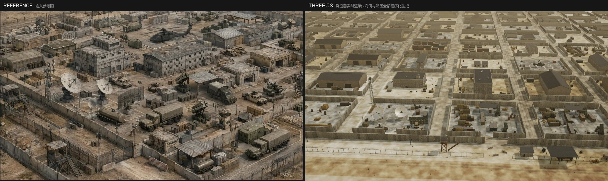
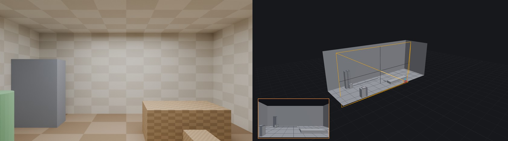

# AI Scene Builder — 一张参考图 → 三维场景的三条路

同一个命题：**给一张参考图，能不能自动生成一个三维场景。**
仓库里有三条互相独立的实现，各自回答这个命题的不同侧面，外加一份把三条摆在一起走查的对照文档，
以及一个打开就能用的浏览器版白盒工具。

> ### 📖 在线阅读（推荐）
> **[https://seanwilliam2077.github.io/AI-PCG-Scene/](https://seanwilliam2077.github.io/AI-PCG-Scene/)**
>
> 四份主文档都是**可动手的交互页**（拖动对比、逐步播放、图上探针、可筛选表格、参数滑块）。
> GitHub 的文件视图对 `.html` 一律显示源码，点开看到的是代码不是网页——要动手请走站点：
>
> | | 在线网页 | 仓库源码 |
> |---|---|---|
> | 线 1 · UE5 资产库管线 | **[打开](https://seanwilliam2077.github.io/AI-PCG-Scene/docs/%E6%8A%80%E6%9C%AF%E6%96%B9%E6%A1%88%E6%8A%A5%E5%91%8A.html)** | [源码](docs/技术方案报告.html) |
> | 线 2 · three.js 程序化生成 | **[打开](https://seanwilliam2077.github.io/AI-PCG-Scene/docs/%E5%AF%B9%E7%85%A7%E5%AE%9E%E9%AA%8C-%E7%A8%8B%E5%BA%8F%E5%8C%96%E5%9C%BA%E6%99%AF%E9%87%8D%E5%BB%BA.html)** | [源码](docs/对照实验-程序化场景重建.html) |
> | 线 3 · Blender 度量闭环 | **[打开](https://seanwilliam2077.github.io/AI-PCG-Scene/docs/%E8%BF%98%E5%8E%9F%E5%BA%A6%E9%97%AD%E7%8E%AF%E8%BF%AD%E4%BB%A3.html)** | [源码](docs/还原度闭环迭代.html) |
> | 三线对照 | **[打开](https://seanwilliam2077.github.io/AI-PCG-Scene/docs/%E4%B8%89%E7%BA%BF%E5%AF%B9%E7%85%A7-%E5%8D%95%E5%9B%BE%E5%88%B0%E4%B8%89%E7%BB%B4%E5%9C%BA%E6%99%AF.html)** | [源码](docs/三线对照-单图到三维场景.html) |
> | 白盒 Live · 传一张图当场出白盒 | **[打开](https://seanwilliam2077.github.io/AI-PCG-Scene/whitebox/)** | [源码](tools/whitebox-web/) |

  
   <em>三条线各自的参考图（上）与结果（下）</em>

> **可比性边界。** 线 1 与线 3 用同一张室内参考图，线 2 用的是另一张（沙漠基地）。
> 所以三条线之间**不能直接比还原度**，能比的是方法结构；一切定量对照都限制在线 1 与线 3 之间。

---

## 线 1 · UE5 资产库管线 — AI 能不能替人搭一个可交付的关卡

  
   <em>左：输入参考图　|　右：管线自动搭建的 UE5 场景（同一机位）</em>

离线阶段把参考图拆成单件、生成 3D 高模并降档，打标注册成 39 个模块的资产库；运行时整条管线跑在
UE5 编辑器内嵌的 Python 里，依次做感知标定、地面射线布局求解、材质氛围、资产库匹配与装配，
阶段之间只交换 JSON，因此可以断点续跑，也可以人工改完再往下走。设计主线是
**「AI 出提案，规则做裁决」**——检测框、三维盒、尺寸、氛围参数都不直接落地，先过确定性的校验、
钳制与推导，最终摆放由布局规则链决定，匹配不上的对象退化成代理盒而不是被丢掉，
所以模型发挥不稳时管线依然产出一个不出怪物的场景。代价也写在文档里：这次自动消失点标定失败
（置信度 0.12），机位是人工覆盖救回来的，而且管线单向前馈，感知误差逐级放大后无法回收。

`端到端 146.7 s（五阶段温缓存实测之和）· 127 actors / 0 error / 0 穿模 / 0 悬空 ·
30 个进匹配对象 → 21 库命中 + 9 代理盒 · 231 次 AI 调用，72.7% 命中缓存（离线可字节级复跑）`

---

## 线 2 · three.js 程序化生成 — 一张图能不能长出一整类场景

  
   <em>左：参考图　|　右：浏览器内实时渲染（机位有意不同）</em>

输入只有一张沙漠前进作战基地的参考图，不匹配任何资产库——先把画面拆成一份可生成的规则清单，
几何与贴图全部在页面加载时由代码算出来。关键机制是**一份总平面数据被两处消费**：4096² 地面贴图
的烘焙和三维物件的摆放读同一份院落网格，所以混凝土场坪的边界永远和院墙对齐；构件也不走
InstancedMesh，而是就地吐世界坐标几何、按材质分桶后各自合并成一个网格，四万多构件因此只剩 14 个网格。
换一个种子约四秒长出另一座结构仍然讲得通的基地。这条线自认的短板是判据全在眼睛里：八轮迭代里有三轮
在「取景」同一条轴上来回横跳，而事后用两条不等式一次就解出了 fov 的可行区间。

`44 897 构件 → 14 个网格 / 每帧 60 次绘制 · 1280×720 帧时间 24.4 ms ·
外部模型与图片文件 0，换种子约 4 s 重建一座 · 121 院落（11 列 × 11 排）`

---

## 线 3 · Blender 度量闭环 — 允许无限循环，还原度的上限在哪

  
   <em>九个里程碑，每格标注改了什么与当时实测的指标</em>

同一张参考图交给 Blender + Cycles，先把「像不像」拆成四件可测的量——容差边缘 F 分数、16 分区曝光
与色相表、直方图交集、逐物体互相关——再跑九轮「渲染 → 度量 → 定位病因 → 改」。两个前置决定撑住了
整条线：相机先由消失点解算定死、其余全挂在它上面；物体布局不写三维坐标，只记它与支撑面接触的那个
**像素**，再反投影解算成米，于是移动一个物体等于改一个像素值，改房间尺寸时所有摆放自动重新推导。
九步走完，边缘结构分数翻了一倍半，而同期 SSIM 几乎没动——这本身成了「SSIM 不能当目标函数」的实测
反例：它奖励一面空白墙胜过一面正确的墙。页面把三个被后续测量推翻的、作者自己下过的结论原样保留。

`边缘 F 0.260 → 0.650 · 边缘精确率 0.203 → 0.701 · 16 分区曝光误差和 5.62 → 2.44 档 ·
同期 SSIM 仅 0.386 → 0.417（反例）· 全程零云端调用、零 API Key`

---

## 白盒 Live · 浏览器内即时白盒 — 线 3 方法论的实时版

  
   <em>左：输入图　|　右：解出的白盒与求解相机（橙色视锥，左下为相机画面）</em>

**[打开即用](https://seanwilliam2077.github.io/AI-PCG-Scene/whitebox/)**，拖一张图进去就出白盒：
LSD 线段检测 + RANSAC 消失点解相机（线 3 的标定方案），Depth Anything V2 出深度，以地面解析单应
当标定靶把深度校成米制，再按视差不连续切分体块。检测到的家具类别会实例化成复合模板
（桌 = 板 + 腿、椅 = 座 + 背、吊灯 = 锥罩 + 吊杆），人/椅/桌的已知高度顺带做尺度锚。
默认是**对位视角**——与输入图同一相机位姿渲染，所以"像不像"一眼可判；切自由环绕可看三维结构，
导出 GLB 直接进 DCC 与引擎。深度推理与几何求解全部在浏览器本地完成，图片不上传；
也可接 Venus VLM（直连或经本地管线代理）替换内置检测，拿到更全的类别与支撑关系。

`纯静态页，无后端 · 首次载入约 25 MB 深度模型（检测模型按需 43 MB）· WebGPU 下端到端约 15 s ·
源码 tools/whitebox-web/（Vite + TypeScript）`

---

## 三线对照 — 同一个模型，三种软件环境

**[打开对照页](https://seanwilliam2077.github.io/AI-PCG-Scene/docs/%E4%B8%89%E7%BA%BF%E5%AF%B9%E7%85%A7-%E5%8D%95%E5%9B%BE%E5%88%B0%E4%B8%89%E7%BB%B4%E5%9C%BA%E6%99%AF.html)**

线 1 与线 3 用的是同一张 1024×572 参考图、同一批资产、同一组解出的内参，所以剩下的差异只能来自
相机外参和**有没有人核对**。页面把线 1 的布局求解器原样重跑：地面纵深按 `d = h·f/(v − v_h)` 计算，
物体越靠近地平线，一个像素的读数偏差被放大得越狠；而线 1 的外参是人工标定后直接下发、
从未投影回参考图验算，这个偏差就一路活到了交付。结论是差距的主因**不是引擎**——引擎只通过
「一轮迭代有多贵」间接决定了这条线能不能有第二轮；真正分开三条线的，是把哪部分交给模型判断、
以及判断完谁来核对。页面另有位姿误差放大器（每拖一格用同一批 70 个检测框重跑一次真实求解器）
与 20 个环节的逐条走查。

`地平线差 91.0 px（同图同内参 f 469.16 px / hfov 95.0°）· 房间地面 78.4 对 27.7 m²（2.8×）·
最远检测框落点 50.40 对 6.38 m（7.9×，且 15 m 外的解被静默丢弃）· 一轮成本 146.7 s / 38.2 s / 约 4 s`

---

## 仓库导览

| 路径 | 内容 |
|---|---|
| `docs/*.html` | 四份交互文档（线 1 / 线 2 / 线 3 / 三线对照）+ 线 1 差距分析；共用 `docs/assets/kit.css`、`kit.js`，零依赖零构建 |
| `docs/PIPELINE_V2_DESIGN.md` · `PIPELINE_REVIEW.md` · `QUICKSTART.md` · `SKILL.md` | 线 1 的架构设计、代码审查、上手指引（`SKILL.md` 可直接丢给 coding agent 跑通全流程） |
| `pipeline/` · `plugin/` | 线 1 源码：五阶段 / 求解与匹配 / 引擎侧；UE 插件 C++ 与 `.uplugin` |
| `process/run_fd6e434f/` | 线 1 过程留档：一次完整运行的全部回执、日志、AI 调用留痕 |
| `process/threejs_fob/` | 线 2 完整可运行源码（3 163 行，唯一依赖 three.js） |
| `process/recon/` · `process/figures/` | 线 3 与线 1/2 的过程图、指标轨迹、标定叠图 |
| `tools/whitebox-web/` | 白盒 Live 源码（Vite + TS）；构建产物在 `whitebox/` 由 Pages 托管 |
| `tools/verify_page.js` | 文档校验器：无头加载，查控制台报错/坏图、控件是否真的响应、两种主题与 390 px 宽下无横向溢出 |
| `media/演示视频.mp4` | 42 秒演示视频 |

## 技术栈

- **线 1**　UE 5.5（内嵌 Python 3.11）· NumPy · OpenCV · PyMeshLab · 云端 VLM 网关 + 图生 3D 服务
- **线 2**　three.js r180 / WebGL2，无构建步骤，几何与贴图全部运行时生成
- **线 3**　Blender 4.2.3 LTS / Cycles（OptiX）· NumPy · OpenCV，全程无云端调用
- **白盒 Live**　transformers.js（WebGPU/WASM）· Three.js · Vite + TypeScript，纯静态托管
- **四份文档**　纯手写 HTML + 自有 kit，零依赖、零构建、零外部请求，`file://` 直接打开也能跑

## 说明

- 本仓库是**脱敏副本**：云服务供应商身份已抽象为「云端 VLM 网关」「云端图生 3D 服务」，
  provider 实现模块（`core/providers3d.py`）不包含在内；库匹配路径与全部规则逻辑完整保留。
  脱敏只涉及线 1——线 2、线 3 与白盒 Live 不调用任何云服务。
- 因此 `docs/` 与 `pipeline/README.md` 中仍有少量指向 `providers3d.py` 的行号引用，属预期。
- 资产库二进制（`.uasset`）、UE 工程本体与 vendor 依赖体积过大，未纳入仓库；完整工程包见交付 zip。
