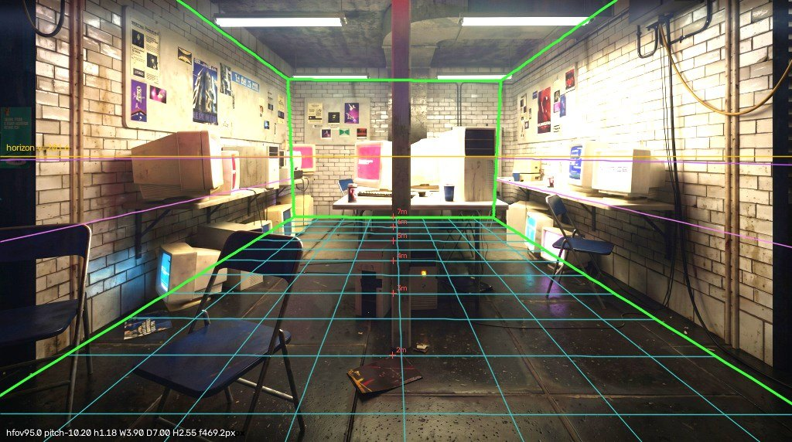
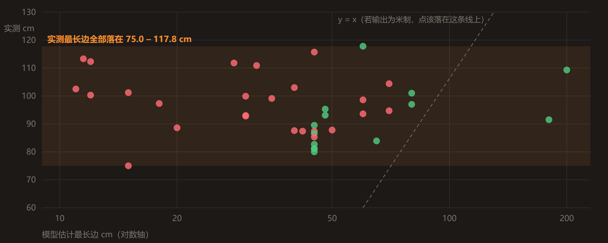

# AI Scene Builder — 一张参考图 → 三维场景的三条路

同一个命题：**给一张参考图，能不能自动生成一个三维场景。**
仓库里有三条互相独立的实现，外加一份把三条撞出来的经验抽成通用做法的方法论、一个浏览器版白盒工具。

 <em>左：输入参考图　|　右：管线自动搭建的 UE5 场景（同一机位）</em>

**在线阅读：[seanwilliam2077.github.io/AI-PCG-Scene](https://seanwilliam2077.github.io/AI-PCG-Scene/)**
三份文档都是可动手的交互页（拖动对比、逐步播放、图上探针、可筛选表、参数滑块）。GitHub 的文件视图对 `.html` 一律显示源码，要动手请走站点。

- **单图重建 · 资产库匹配与度量闭环**　[打开](https://seanwilliam2077.github.io/AI-PCG-Scene/docs/%E5%8D%95%E5%9B%BE%E9%87%8D%E5%BB%BA-%E8%B5%84%E4%BA%A7%E5%BA%93%E5%8C%B9%E9%85%8D%E4%B8%8E%E5%BA%A6%E9%87%8F%E9%97%AD%E7%8E%AF.html)　｜　[源码](docs/单图重建-资产库匹配与度量闭环.html)
- **程序化生成 · 一张图长出一整类场景**　[打开](https://seanwilliam2077.github.io/AI-PCG-Scene/docs/%E5%AF%B9%E7%85%A7%E5%AE%9E%E9%AA%8C-%E7%A8%8B%E5%BA%8F%E5%8C%96%E5%9C%BA%E6%99%AF%E9%87%8D%E5%BB%BA.html)　｜　[源码](docs/对照实验-程序化场景重建.html)
- **方法论 · 语义走模型，几何走算法**　[打开](https://seanwilliam2077.github.io/AI-PCG-Scene/docs/%E6%96%B9%E6%B3%95%E8%AE%BA-%E5%8D%95%E5%9B%BE%E5%88%B0%E4%B8%89%E7%BB%B4%E7%BE%8E%E6%9C%AF%E5%9C%BA%E6%99%AF.html)　｜　[源码](docs/方法论-单图到三维美术场景.html)

> **可比性边界。** 线 1 与线 3 用的是同一张室内参考图，线 2 用的是另一张（沙漠基地）——
> 所以三条线之间**不能直接比还原度**，能比的只有方法结构；一切定量对照都限制在共用同一张图的线 1 与线 3 之间。

## 单图重建 · 资产库匹配与度量闭环 — 同一张图，两条路

 <em>线 3 把解出的房间线框、0.5 m 地面栅格与地平线画回参考图逐点核对；线 1 的外参从未这样验算过</em>

线 1 在 UE5 编辑器内嵌的 Python 里跑单向前馈：感知标定 → 地面射线布局 → 材质氛围 → 资产库匹配与装配，阶段之间只交换 JSON，可断点续跑。主线是「AI 出提案，规则做裁决」——匹配不上的对象退化成代理盒而不是被丢掉，所以模型发挥不稳时依然产出一个不出怪物的场景。代价也写在文档里：这次自动消失点标定失败（置信度 0.12），机位是人工覆盖救回来的，而且管线单向前馈，感知误差逐级放大后无法回收。

线 3 用同一张图、同一批资产走另一条路：先把「像不像」拆成可测量的量，再跑九轮「渲染 → 度量 → 定位病因 → 改」，相机由消失点解出后定死、并投影回原图核对。两条线的外参一比，地平线差 91.0 px，解出的房间地面差 2.8 倍。文档里三个被后续测量推翻的、作者自己下过的结论按原样保留。

`127 actors / 0 error / 0 穿模 / 0 悬空 · 边缘 F 0.260 → 0.650 · 21 库命中 + 9 代理盒`

## 程序化生成 · 一张图能不能长出一整类场景

 <em>左：参考图　|　右：浏览器内实时渲染（机位有意不同）</em>

输入只有一张沙漠前进基地的参考图，不匹配任何资产库——先把画面拆成一份可生成的规则清单，几何与贴图全部在页面加载时由代码算出来；同一份总平面数据被地面烘焙与三维摆放两处消费，所以场坪边界永远和院墙对齐。这条线自认的短板是判据全在眼睛里：八轮迭代里有三轮在「取景」同一条轴上来回横跳，而事后用两条不等式一次就解出了 fov 的可行区间。

`44 897 构件 / 每帧 60 draw call · 外部资源文件 0，换个种子约 4 s 长出另一座`
（这两个数没有落盘文件，是实时场景 HUD 的现场读数 —— `process/threejs_fob/src/main.js` 里那段 `renderer.info.render`；线 1、线 3 的读数都有对应的 JSON。）

## 方法论 · 语义走模型，几何走算法

 <em>横轴是模型估计的最长边（跨 10–200 cm），纵轴是实测：39 个模块全部挤在 75–118 cm 一条带里，与虚线 y = x 毫无关系</em>

把同一个命题撞三遍换来的经验，写成不绑定本仓库代码、换个项目也照做得出来的做法：图像的识别与分割、对应资产的生成、DCC 里的相机还原与位姿估计。贯穿全篇的判据只有一条——模型擅长说「这是什么」，不擅长说「这有多大、在哪里」。适用边界写在正文里而不是脚注，包括自己踩塌的那几条：「放大钳到 1.7×」的前提是库网格已按真实尺寸建模，而图生 3D 的输出是归一化的，于是折叠桌被钳到比正确值短 15%，**而这 15% 是钳制自己造成的**。

`三条补召回贡献 49/70 检出 · 39 模块实测最长边 75.0–117.8 cm · 数据经 tools/export_method_data.py 可复跑导出`

## 白盒 Live · 拖一张图进浏览器，当场出白盒

 <em>左：输入图　|　右：解出的白盒与求解相机（橙色视锥，左下为相机画面）</em>

LSD + RANSAC 解相机（线 3 的标定方案），深度模型出深度、以地面解析单应校成米制，再按视差不连续切分体块，导出 GLB 直接进 DCC。推理与几何求解全部在浏览器本地完成，图片不上传。
**[打开即用](https://seanwilliam2077.github.io/AI-PCG-Scene/whitebox/)**　｜　[源码](tools/whitebox-web/)　｜　演示视频 [`media/演示视频-剪辑.mp4`](media/演示视频-剪辑.mp4)（约 38 秒，线 1 五阶段实跑）

<b>仓库导览与技术栈</b>

| 路径 | 内容 |
|---|---|
| `docs/*.html` | 三份交互文档（单图重建 / 程序化生成 / 方法论）；共用 `docs/assets/kit.css`、`kit.js`，零依赖零构建 |
| [`PIPELINE_V2_DESIGN.md`](docs/PIPELINE_V2_DESIGN.md) · [`PIPELINE_REVIEW.md`](docs/PIPELINE_REVIEW.md) · [`QUICKSTART.md`](docs/QUICKSTART.md) · [`SKILL.md`](docs/SKILL.md) | 线 1 的架构设计、代码审查、上手指引（`SKILL.md` 可直接丢给 coding agent 跑通全流程） |
| `pipeline/` · `plugin/` | 线 1 源码：五阶段 / 求解与匹配 / 引擎侧；UE 插件 C++ 与 `.uplugin` |
| `process/run_fd6e434f/` | 线 1 过程留档：一次完整运行的全部回执、日志、调用留痕 |
| `process/threejs_fob/` | 线 2 完整可运行源码（唯一依赖 three.js） |
| `process/recon/` · `process/figures/` | 线 3 与线 1 / 线 2 的过程图、指标轨迹、标定叠图 |
| `tools/whitebox-web/` | 白盒 Live 源码（Vite + TypeScript）；构建产物在 `whitebox/` 由 Pages 托管 |
| `tools/export_method_data.py` · `tools/verify_page.js` | 方法论数据导出（可复跑）· 文档校验器（无头加载，查控制台报错与坏图、控件是否真的响应、两种主题与 390 px 宽下无横向溢出） |

- **线 1**　UE 5.5（内嵌 Python 3.11）· NumPy · OpenCV · PyMeshLab · 云端 VLM 网关 + 云端图生 3D 服务
- **线 2**　three.js r180 / WebGL2，无构建步骤，几何与贴图全部运行时生成
- **线 3**　Blender 4.2.3 LTS / Cycles（OptiX）· NumPy · OpenCV，全程无云端调用
- **白盒 Live**　transformers.js（WebGPU / WASM）· Three.js · Vite + TypeScript，纯静态托管
- **三份文档**　纯手写 HTML + 自有 kit，零依赖、零构建、零外部请求，`file://` 直接打开也能跑

## 说明

- 本仓库是**脱敏副本**：云服务供应商身份已抽象为「云端 VLM 网关」「云端图生 3D 服务」，provider 实现模块（`core/providers3d.py`）不包含在内；库匹配路径与全部规则逻辑完整保留。脱敏只涉及线 1——线 2、线 3 与白盒 Live 不调用任何云服务。
- 因此 `docs/` 与 `pipeline/README.md` 中仍有少量指向 `providers3d.py` 的行号引用，属预期。
- 资产库二进制（`.uasset`）、UE 工程本体与 vendor 依赖体积过大，未纳入仓库；完整工程包见交付 zip。
